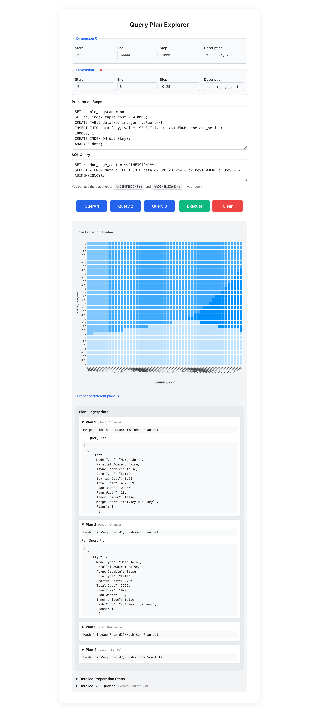
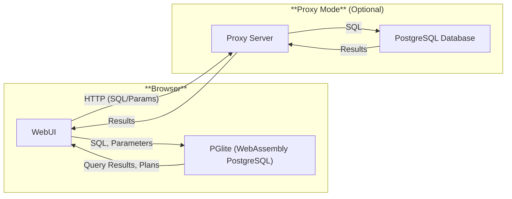

<!-- Badges -->
<p align="center">
  <a href="https://github.com/jnidzwetzki/planexplorer/actions">
    
  </a>
  <a href="https://jnidzwetzki.github.io/planexplorer/">
    
  </a>
</p>

<p align="center">
 <strong>Explore and visualize how PostgreSQL chooses query plans for your SQL – all in your browser.</strong>
</p>


# Plan Explorer

Plan Explorer is a web application for visualizing the different query plans that PostgreSQL generates for a particular query across multi-dimensional parameter spaces.

The tool allows users to explore how PostgreSQL's query planner chooses different execution plans based on query parameters and cost settings—that is, it shows when PostgreSQL selects a different plan due to changing parameters.

All of this runs entirely in the browser, without requiring a separate database server. Plan Explorer is inspired by the [Picasso database query optimizer visualizer](https://dl.acm.org/doi/10.14778/1920841.1921027), which implements similar ideas and functions. 

> [!NOTE]
> This project is a research prototype and is purely vibe coded to [explore how research tools](https://jnidzwetzki.github.io/2025/05/18/building-a-query-plan-explorer.html) can be generated with little effort these days. So, it may not always have the most understandable or conventionally structured source code.

## Features
- **Flexible Search Space**: Define one- or two-dimensional parameter spaces (e.g., predicate selectivity, cost parameters) to iterate over.
- **Custom SQL Queries**: Input your own SQL queries with placeholders for dynamic parameters.
- **Plan Fingerprinting**: Automatically groups and colors similar query plans for easy visualization.
- **No Backend Required (In-Browser Mode)**: All computation and visualization happen client-side. Uses [PGlite](https://pglite.dev/), a WebAssembly build of PostgreSQL, to run queries and generate plans directly in your browser. This mode is fully standalone and requires no server or backend—everything runs locally in your browser.
- **Optional Proxy Mode**: For advanced use cases, you can connect Plan Explorer to a real PostgreSQL database server via a lightweight Node.js proxy. This enables working with large datasets or features not supported by PGlite. See the section "Modes of Operation" below for details.



## Example Use Cases
- Visualize when PostgreSQL switches from a table scan to an index scan as selectivity or cost parameters change.
- Explore the impact of `random_page_cost` and other planner settings on query plan selection.
- Analyze complex queries, such as self-joins, and observe how the planner chooses among multiple strategies.

## Usage

1. **Define Search Space**: Set up to two dimensions (ranges and steps) for the parameters you want to explore.
2. **Database Setup**: Enter SQL statements to prepare your database (e.g., create tables, insert data).
3. **Query Input**: Write your SQL query using placeholders (`%%DIMENSION0%%`, `%%DIMENSION1%%`) for dynamic parameters.
4. **Run**: Execute the analysis and view the resulting plan visualization.

## Modes of Operation

Plan Explorer can be used in two modes:

- **In-Browser Mode (default):** All query execution and plan analysis happen directly in your browser using [PGlite](https://pglite.dev/), a WebAssembly build of PostgreSQL. No backend or server setup is required.
- **Proxy Mode (dev:full):** The application connects to a real PostgreSQL database server via a lightweight Node.js proxy. This mode is useful for working with large datasets or features not supported by PGlite. Credentials for the database connection are read from a `.env` file (see below).

## Architecture



- **In-Browser Mode:** All arrows stay within the "Browser" box. No backend or network required.
- **Proxy Mode:** The browser app communicates with the proxy server, which forwards queries to a real PostgreSQL database and returns results.

## Getting Started

### Prerequisites
- [Node.js](https://nodejs.org/) (v18 or newer recommended)
- [npm](https://www.npmjs.com/) or [yarn](https://yarnpkg.com/)

### Installation

1. **Clone the repository:**
   ```bash
   git clone https://github.com/jnidzwetzki/planexplorer.git
   cd planexplorer
   ```
2. **Install dependencies:**
   ```bash
   npm install
   # or
   yarn install
   ```
3. **Start the development server:**
   ```bash
   npm run dev
   # or
   yarn dev
   ```
4. **Open your browser:**
   Visit [http://localhost:3000](http://localhost:3000) to use the app.

### Build for Production

```bash
npm run build
npm start
```

## Connecting to a Database Server (dev:full mode)

In addition to running fully in the browser, Plan Explorer supports connecting to a real PostgreSQL database server when running in `dev:full` mode. In this mode, the application reads database connection credentials from a `.env` file in the project root.

### Usage

1. **Create a `.env` file** in the project root (or copy the provided `.env.example`):
   ```bash
   cp .env.example .env
   ```
2. **Edit the `.env` file** and set your database credentials:
   ```env
   PGHOST=localhost
   PGPORT=5432
   PGUSER=your_db_user
   PGPASSWORD=your_db_password
   PGDATABASE=your_db_name
   ```
3. **Start the app in full server mode:**
   ```bash
   npm run dev:full
   # or
   yarn dev:full
   ```

When running in this mode, queries and plan analysis are executed against the configured PostgreSQL server instead of the in-browser database.

## Example

To see the tool in action, visit the live demo: [https://jnidzwetzki.github.io/planexplorer/](https://jnidzwetzki.github.io/planexplorer/)

## Technologies Used
- [React](https://react.dev/) (with TypeScript)
- [PGlite](https://pglite.dev/) (PostgreSQL in WebAssembly)

## License

This project is open source. See [LICENSE](LICENSE) for details.

## Acknowledgements
- Inspired by [Picasso: The Database Query Optimizer Visualizer](https://dl.acm.org/doi/10.14778/1920841.1921027)
- Built with the help of GitHub Copilot and VS Code agent mode
